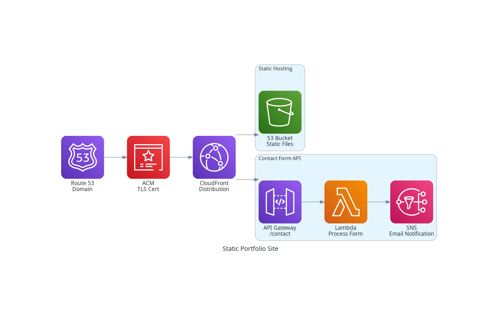

# Cloud Engineer Portfolio Site (Static + Serverless)

This project is a static portfolio website deployed on AWS using a serverless backend for the contact form. It demonstrates how to host a static site with global distribution, secure it with TLS, and integrate Lambda-powered APIs for dynamic functionality.

## Architecture

Route 53 → ACM (TLS) → CloudFront Distribution → S3 (static site) → API Gateway → Lambda → SNS

- **S3** – Hosts the static HTML/CSS/JS.
- **CloudFront** – Provides caching, global distribution, and routes /contact requests to API Gateway.
- **ACM** – Manages the TLS certificate for the custom domain.
- **Route 53** – DNS and domain management.
- **API Gateway** – Entry point for the contact form API.
- **Lambda** – Processes form submissions and publishes to SNS.
- **SNS** – Sends email notifications for form submissions.

## Challenges & Fixes

- **403 Errors** – Caused by CloudFront behavior/header config, resolved by adjusting policies.
- **500 Errors from Lambda** – Fixed by improving error handling and debugging CloudWatch logs.
- **IAM Issues** – Lambda initially lacked permission to publish to SNS; fixed by attaching the correct policy.
- **Form Submission Mismatch** – HTML form sent `application/x-www-form-urlencoded` but Lambda expected JSON. Adjusted handler logic and frontend script.
- **CloudFront Caching** – Old static files were being served. Fixed by creating invalidations (`/*`).

## Outcome

- Static site with a working contact form is live.
- Demonstrated full flow from form → API Gateway → Lambda → SNS → email.
- Validated CloudFront behavior routing, IAM policies, and cache management.

## Next Steps

- Automate deployment (S3 sync + CloudFront invalidation + Terraform/OpenTofu for infra).
- Resume work on a Next.js + Cognito + DynamoDB portfolio CMS (more dynamic/blog-focused).
